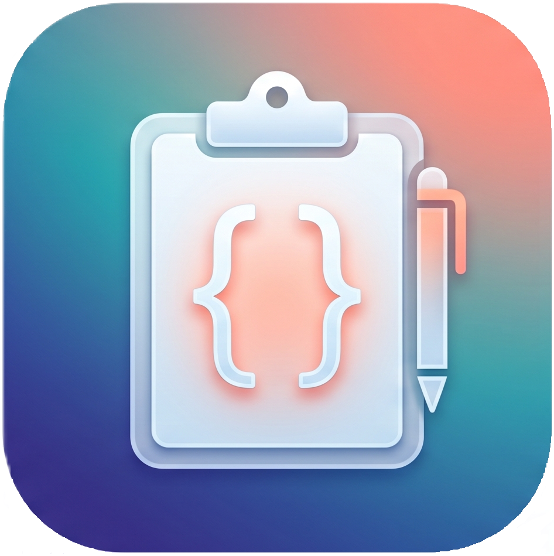

<!-- # 📋 GlyphBoard -->

<div align="center">
  <table border="0" style="border-collapse: collapse; border: none;">
    <tr style="border: none;">
      <td align="center" valign="middle" style="border: none; padding-right: 15px;">
        
      </td>
      <td align="left" valign="middle" style="border: none;">
        <h1 style="border-bottom: none; margin: 0; padding: 0;"><strong>GlyphBoard</strong></h1>
        <p style="margin: 4px 0 0 0;"><em>A sleek, modern, and high-performance solution built for the future.</em></p>
      </td>
    </tr>
  </table>

  <br />

  <a href="https://github.com/vedanshsaxena23">
    
  </a>
  <a href="https://www.linkedin.com/in/hey-its-vedansh-saxena">
    
  </a>
  <a href="https://www.instagram.com/_vedansh.saxena_">
    
  </a>
  <a href="/LICENSE.md">
  
</a>
</div>
<br/>


```text
  ___ ___ 
 / __| _ )   v1.0.0 — “Aegis”
| (_ | _ \   Hardware-Bound Cryptographic Vault
 \___|___/   Status: Official Production Release
  AEGIS      Zero Cloud • Hardware AES-256 • TOTP 2FA
```

> [!IMPORTANT]
> **Production Release v1.0.0 ("Aegis") is live.** GlyphBoard now features full dual-database storage (IndexedDB + SQLite WAL), hardware-tied AES-256-GCM encryption, TOTP two-factor authentication, and multi-distro Linux packages (`.deb`, `.rpm`, `AppImage`).
>
> <details>
> <summary><b>⚡ [CLASSIFIED] Code Name: "Aegis"</b></summary>
>
> In ancient myth, the **Aegis** (*αἰγίς*) was the impenetrable shield borne by Athena and Zeus—the ultimate ward against hostile forces. In this release, your clipboard ceases to be an unmonitored cache and becomes an impenetrable local bastion: cryptographic salts bound directly to machine hardware, explicit zero-fill memory wiping, and total local sovereignty. 🛡️✨
> 
>  > *(Also crafted over late-night coding sessions while obsessively binge-watching Lanterns on HBO 🟢💡)*
</details>

<br/>
<br/>

GlyphBoard is a clean, modern, high-performance offline code clipboard and snippet workspace manager tailored specifically for developers. Built on a fully decentralized architectural design, the application runs entirely locally on your hardware with zero external server dependencies, guaranteeing ironclad privacy and instantaneous data load workflows.

---
## 🧑‍💻Glyphboard Demo 
<div align="center">
  
</div>

---
## ✨ Key Features

* **Hardware-Bound AES-256-GCM Encryption:** Secures snippets at rest using PBKDF2 key derivation paired with hardware-bound, isolated salts.
* **Dual-Engine Pluggable Storage:** Seamlessly toggle between client-side IndexedDB and an encrypted SQLite backend with persistent configuration tracking.
* **Multi-Factor Authentication (Password & TOTP):** Enforces local access control through strong passphrase hashing and standard Time-based One-Time Password (TOTP) two-factor verification with integrated QR code provisioning.
* **SQLite WAL & Schema Safety:** High-throughput SQLite operations running in Write-Ahead Logging (WAL) mode, featuring safe schema migrations, chronological sorting, and clean checkpointing.
* **OS-Level Credential Protection:** Direct integration with OS Credential Manager (DPAPI SafeStorage) ensures encryption secrets and configuration tokens are never exposed on raw disk storage.
* **Zero-Knowledge Canary Sentinel:** Verifies local database integrity and validates passphrases without ever exposing raw cryptographic material.
* **In-Memory Guard & Auto-Locking:** Automated workspace locking during idle states paired with zero-residue, explicit memory key wiping routines.
* **Embedded Monaco Code Editor:** Integrates the native VS Code editor engine straight to your desktop layout for syntax highlighting, auto-formatting, and intelligent completions[cite: 1].
* **Atomic Lifecycle Resets:** Safe database maintenance supporting clean atomic snippet purging and safe, non-destructive profile resets.
* **Modernized UI/UX:** Refined dark-mode styling, responsive layouts, and clean visual themes designed for distraction-free coding workflows.
* **100% Offline & Telemetry-Free:** Zero network pings, zero tracking endpoints, and zero cloud dependencies. Your data lives exclusively on your disk.

---

## 📂 System Project Hierarchy

The project operates under a unified layout framework context, discarding root workspace separation constraints to optimize asset mapping paths:

```text
GLYPHBOARD/
├── assets/                # Visual assets (demo GIFs, UI previews)
├── dist/                  # Vite production compilation output
├── node_modules/          # Workspace runtime package dependencies
├── public/                # Static application assets (logos, icons)
├── release/               # Packaged production installer outputs
├── splash/                # Splash screen viewport & loading states
│   └── components/        # Splash screen UI primitives
├── src/                   # Active React functional components & views
│   ├── assets/            # CSS layouts, Tailwind styles, typography
│   ├── Components/        # Core UI views (Sidebar, MainView, Modals)
│   └── utilities/         # Storage managers (IndexedDB & SQLite handlers)
├── .gitignore             # Git ignore configurations
├── eslint.config.js       # Code quality and sanity checking
├── index.html             # Application mounting DOM tree
├── LICENSE.md             # GPL-3.0 legal terms
├── main.js                # Core Electron background entry script
├── main-db.js             # Electron SQLite backend & IPC layer
├── package.json           # Application packaging rules, scripts, & dependencies
├── postcss.config.mjs     # PostCSS styling transformation pipeline
├── README.md              # Project documentation
└── vite.config.js         # Client compilation configuration

```

---

## 🛠️ Installation & Active Workspace Execution

Ensure you have [Node.js](https://nodejs.org/) setup on your machine.

1. **Clone the repository space and navigate inside:**
```bash
git clone https://github.com/your-username/glyphboard.git
cd glyphboard
```


2. **Install all production node packages:**
```bash
npm install
```


3. **Launch the app in the local hot-reloaded development tracking state:**
```bash
npm run dev
```


*(Then launch `npm run electron` in a parallel window to hook the layout up inside the shell layer).*

---

## 🚀 Packaging the Portable Desktop Application

To generate a single, standalone portable `.exe` file that executes instantly without walking through any installer wizard configurations:

1. Run the unified compilation and packaging pipeline script:
```bash
npm run app:build

```


2. Once the script hits execution milestones, navigate to the local root directory:
```text
/release/

```

3. Fire up **`GlyphBoard Aegis_Setup_1.0.0.exe`** right off your hard drive. It will generate its storage footprints dynamically and run smoothly with zero network tracking hoops!

---
## 🛡️ License & Sovereign Rights

GlyphBoard is fundamentally built on the principle of absolute privacy and local data sovereignty. 

* **No Tracking, No Accounts, No Catch:** There is no license to purchase, no corporate telemetry tracking your patterns, and no cloud server collecting your private code snippet configurations.
* **100% Free & Open:** You have full access to run, modify, or bundle the compilation matrix exactly how you see fit. Your snippets belong completely to your hard drive.

---
---

## 📜 License & Sovereign Rights

GlyphBoard is fundamentally built on the principle of absolute privacy, local data sovereignty, and open-source freedom. 

* **License:** This project is licensed under the **GNU General Public License v3.0** — see the [LICENSE](LICENSE.md) file for complete details.
* **100% Free & Copyleft:** You have full access to run, study, modify, and distribute this software. Any derivative works must also be open-sourced under the same GPLv3 terms.
* **No Telemetry, No Accounts:** Your code snippet configurations and clipboard data remain entirely on your local machine.

---

🔒 **"Your code. Your system. Zero compromises."**  
Crafted with 💻 by **Vedansh Saxena** *(fueled by coffee and HBO's Lanterns)*.
